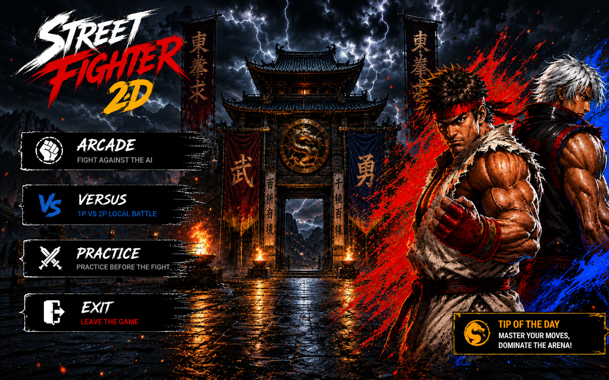
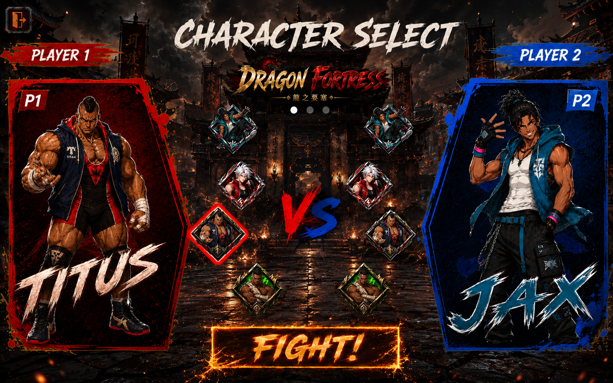
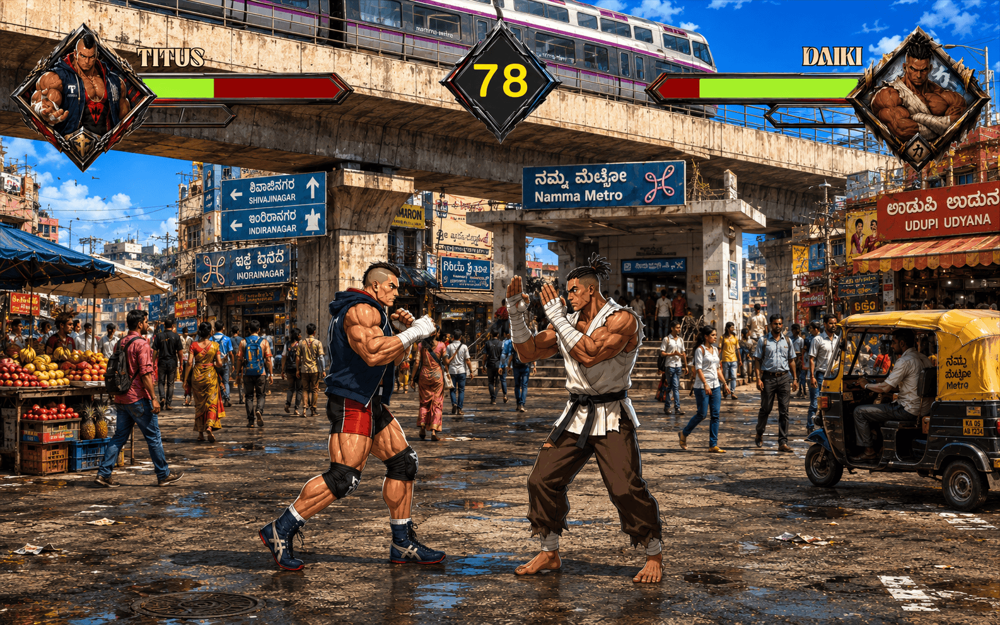
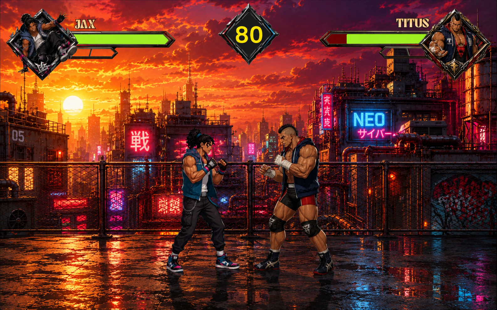
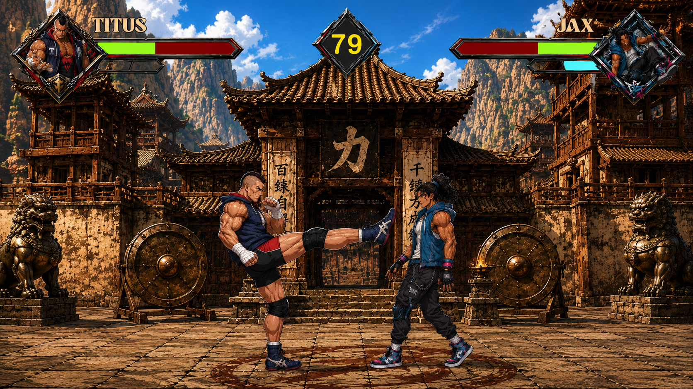

<div align="center">
  
# ⚔️ Street Fighter 2D

</div>

<div align="center">

### A Fast-Paced 2D Side-Scrolling Fighting Game Built with Unity

A project-based learning milestone that combines custom fighting game logic, AI combat behavior, handcrafted animation pipelines, and high-energy arcade gameplay into a polished browser-playable experience.

<p>
  <a href="https://sujalvk.itch.io/street-fighter-2d" target="_blank">
    
  </a>
  <a href="https://github.com/sujalvk888/StreetFighter2D-Game" target="_blank">
    
  </a>
</p>

<p>
  
  
  
  
</p>

</div>

---

# 📖 Overview

**Street Fighter 2D** is a browser-playable 2D side-scrolling fighting game built in Unity and deployed through WebGL on Itch.io. It was created as a project-driven learning milestone to push technical boundaries, explore a demanding gameplay genre, and build a complete solo production pipeline from scratch.

Rather than relying on pre-made studio assets, the project emphasizes self-sourced art, custom animation processing, audio assembly, character logic, and combat system design. The result is a compact but ambitious arcade fighter that highlights adaptability, creativity, and hands-on engineering across gameplay, animation, and presentation.

The game includes multiple play modes, a balanced four-character roster, distinctive stage environments, and a custom CPU opponent built with proximity-aware fighting logic. It is designed to capture the feel of classic arcade fighters while demonstrating the full production workflow behind a modern indie game.

---

# ✨ Features

## 🥊 Fast-Paced Fighting Gameplay

The game focuses on tight, responsive combat with classic arcade fighter pacing.

Core gameplay includes:

- Side-scrolling 2D combat
- Real-time movement and attacks
- Blocking and defensive play
- Health-based match outcomes
- Hit reactions and round pressure

---

## 🎮 Multiple Play Modes

Street Fighter 2D includes several ways to play and practice.

### Arcade Mode
Fight against a custom AI opponent with dynamic combat decisions.

### Versus Mode
Play local head-to-head matches on a shared keyboard layout.

### Practice Mode
Train against an infinite-health dummy to learn spacing, timing, and combos.

---

## 🤖 Custom CPU Opponent

The game includes an AI system that reacts to distance and combat state.

AI behavior supports:

- Proximity-aware decisions
- Defensive blocking
- Offensive attack routing
- Randomized cooldowns
- Less predictable combat patterns

---

## 🧍 Four-Character Roster

The game features a balanced roster with distinct visual identities and fighting styles.

Included fighters:

- **Titus** — a heavy power brawler
- **Jax** — a fast, agile street fighter
- **Daiki** — a traditional martial arts master
- **The Silver-Haired Challenger** — a sleek, confident fighter

---

## 🏟️ Distinct Battle Arenas

Each stage adds visual personality to the experience.

Included stages:

- Ancient Oriental Temple
- Cyberpunk Rooftop Sunset
- Namma Metro Street Stage

---

## 🎞️ Handcrafted Animation Pipeline

Character motion was built through a multi-step production workflow designed to create smooth, high-FPS movement.

Highlights include:

- AI-assisted motion generation
- Blender-based sprite sheet slicing
- Unity animation interpolation
- Smooth frame transitions
- 60 FPS presentation focus

---

## 🔊 Custom Audio Design

The sound design was assembled manually to support the game's arcade feel.

Audio features include:

- Curated background music
- Impact-heavy hit effects
- Collision sound cues
- Custom audio triggering scripts

---

## ⌨️ Classic Fighting Game Controls

The control scheme uses familiar arcade-style mappings for each player.

Supports:

- Left / right movement
- Jumping
- Blocking
- Light / medium / heavy attacks

---

## 🌐 WebGL Browser Deployment

The game is exported for browser play and hosted on Itch.io, making it easy to access without a local installation.

---

# 🚀 Why This Project?

Street Fighter 2D was built as a portfolio-level learning challenge that goes beyond basic game tutorials. The goal was not just to make a fighting game, but to understand how to design one from the ground up: controls, AI, animation, audio, combat states, UI, and stage presentation.

Throughout the project, several important skills were explored:

- Game loop design
- Character movement systems
- Fighting game combat logic
- AI decision-making
- Animation pipeline creation
- Audio integration
- Unity scene management
- Input handling for two players
- WebGL deployment
- Production-style asset organization

This project reflects a strong commitment to learning by building, experimenting, and solving difficult problems independently.

---

# 🛠️ Tech Stack

## Game Engine

| Technology | Purpose |
|------------|---------|
| Unity 6 / Unity 2022 LTS | Game Development Engine |
| WebGL | Browser Deployment Target |
| URP | Rendering Pipeline |

---

## Gameplay & Logic

| Technology | Purpose |
|------------|---------|
| C# | Game Scripting |
| AI Brain System | CPU Combat Logic |
| Player Movement Script | Input and Motion |
| Combat HUD Manager | Health and Round UI |
| Character Select Manager | Fighter Selection Flow |

---

## Asset Pipeline

| Technology | Purpose |
|------------|---------|
| Google Labs Video Generation | Motion Concepting |
| Blender | Sprite Sheet Processing |
| Spine 2D / Unity Anima2D | Animation Interpolation |
| Audio Conversion Tools | Sound Format Optimization |

---

## Development Tools

- Git
- GitHub
- Unity
- Blender
- Itch.io

---

# 🎨 Animation Pipeline

The character animation workflow was intentionally built to combine modern AI-assisted generation with traditional game asset processing.

```text
Concept Art
     │
     ▼
AI Motion Generation
     │
     ▼
Video Clip Output
     │
     ▼
Blender Processing
     │
     ▼
Sprite Sheet Extraction
     │
     ▼
Unity Import
     │
     ▼
2D Animation Interpolation
     │
     ▼
Smooth In-Game Motion
```

---

## How the Pipeline Works

The process began with raw character concepts and motion ideas. These were used to generate movement references, which were then processed into game-ready frame assets. Blender was used to slice and prepare the visuals into clean sprite sheets, and Unity handled the runtime animation system using interpolation tools to smooth transitions between frames.

This approach allowed the game to achieve a polished visual feel without relying on a large external art pipeline.

---

# 🏗️ Architecture

Street Fighter 2D follows a modular Unity-based game architecture where gameplay logic, combat state management, AI behavior, and HUD control are separated into dedicated scripts.

```text
                 ┌──────────────────────┐
                 │       Player         │
                 └──────────┬───────────┘
                            │
                            ▼
                   Unity Input System
                            │
          ┌─────────────────┼─────────────────┐
          ▼                 ▼                 ▼
   PlayerMovement.cs   CombatHUDManager.cs  CharacterSelectManager.cs
          │                 │                 │
          └─────────────────┼─────────────────┘
                            ▼
                        AIBrain.cs
                            │
                            ▼
                   Combat & Match Logic
                            │
                            ▼
                     Unity Scene Update
```

---

## High-Level Gameplay Flow

```text
Start Game
   │
   ▼
Select Mode
   │
   ├──────────────┬──────────────┐
   ▼              ▼              ▼
Arcade Mode   Versus Mode   Practice Mode
   │              │              │
   ▼              ▼              ▼
CPU Fight     Local 1v1     Training Dummy
   │              │              │
   └──────────────┴──────────────┘
                  ▼
              Match End
```

---

## Project Structure

```text
StreetFighter2D-Game/
│
├── Assets/
│   ├── Scripts/
│   │   ├── AIBrain.cs
│   │   ├── PlayerMovement.cs
│   │   ├── CombatHUDManager.cs
│   │   └── CharacterSelectManager.cs
│   │
│   ├── Audio/
│   ├── Scenes/
│   ├── Sprites/
│   └── UI/
│
├── Packages/
├── ProjectSettings/
└── README.md
```

## 🎬 Live Demo

<p align="center">
  
</p>


---


## 📸 Screenshots

### 🎮 Main Menu

| Home Screen |
|------------|
|  |

---

### ⚔️ Character Selection

| Character Select |
|-----------------|
|  |

---

### 🥊 Gameplay

| Metro City Stage | Cyberpunk Rooftop Stage | Dragon Fortress Stage |
|------------------|-------------------------|-----------------------|
|  |  |  |

---

# 🌐 Live Demo

### 🎮 Playable Build

**Itch.io**

https://sujalvk.itch.io/street-fighter-2d

---

### 📦 Source Repository

**GitHub**

https://github.com/sujalvk888/StreetFighter2D-Game.git

---

## 🖥️ Deployment

| Service | Platform |
|---------|----------|
| Game Build | Itch.io |
| Source Control | GitHub |
| Target Platform | WebGL |
| Engine | Unity 6 / Unity 2022 LTS |

---

> **Next:** Installation, Unity setup, controls, gameplay systems, AI behavior, deployment workflow, and project configuration.


# ⚙️ Installation

Follow the steps below to run **Street Fighter 2D** locally in Unity.

## 📋 Prerequisites

Before getting started, make sure you have the following installed:

- Unity 6 or Unity 2022 LTS
- A compatible WebGL build module
- Git

Verify your Unity setup inside the Unity Hub before opening the project.

---

# 📥 Clone the Repository

```bash
git clone https://github.com/sujalvk888/StreetFighter2D-Game.git
```

Then open the project in **Unity Hub** by selecting the cloned folder.

---

# 🎮 Unity Setup

Once the project is opened in Unity:

1. Allow Unity to finish importing assets and packages.
2. Open the main scene from the `Assets/Scenes` folder.
3. Wait for all sprites, audio files, and animation assets to load.
4. Confirm that the project is using the **Universal Render Pipeline (URP)**.
5. Make sure the correct input mappings are assigned for both players.
6. Check the WebGL build settings before exporting.

If Unity asks to regenerate files or update packages, allow it to complete the process before testing the game.

---

# ▶️ Running the Game in Unity

To test the game inside the editor:

```text
Open the main scene
        │
        ▼
Press Play
        │
        ▼
Select a mode
        │
        ▼
Start the match
```

You can test:

- Arcade Mode
- Versus Mode
- Practice Mode

---

# ⌨️ Controls

The game uses a classic two-player arcade-style keyboard layout.

| Action | Player 1 | Player 2 |
|--------|----------|----------|
| Move Left | A | Left Arrow |
| Move Right | D | Right Arrow |
| Jump | W | Up Arrow |
| Block / Guard | S | Down Arrow |
| Light Attack | J | B |
| Medium Attack | K | N |
| Heavy Attack | L | M |

---

# 📂 Project Structure

The repository is organized to keep gameplay logic, assets, and scene files cleanly separated.

```text
StreetFighter2D-Game/
│
├── Assets/
│   ├── Audio/
│   ├── Scenes/
│   ├── Scripts/
│   │   ├── AIBrain.cs
│   │   ├── PlayerMovement.cs
│   │   ├── CombatHUDManager.cs
│   │   └── CharacterSelectManager.cs
│   │
│   ├── Sprites/
│   └── UI/
│
├── Packages/
├── ProjectSettings/
└── README.md
```

---

# 🕹️ Gameplay Modes

Street Fighter 2D includes three core play modes.

## 🥊 Arcade Mode

Fight against a custom CPU opponent.

Arcade Mode includes:

- Proximity-aware AI
- Defensive blocking
- Offensive decision routing
- Randomized cooldown behavior

This mode is designed to simulate a classic one-on-one arcade challenge.

---

## 🤜🤛 Versus Mode

Play local matches against another player on the same keyboard.

Versus Mode supports:

- Shared keyboard input
- Head-to-head combat
- Competitive round-based matches

---

## 🧪 Practice Mode

Practice Mode gives players a safe training environment.

It includes:

- Infinite-health training dummy
- Hitbox practice
- Timing drills
- Move testing
- Combo rehearsal

This mode is ideal for learning character mechanics and match spacing.

---

# 🤖 AI / Combat Systems

The game uses several custom scripts to drive its fighting game logic.

## AIBrain.cs

Handles CPU behavior and decision-making.

Responsibilities include:

- Reading distance between fighters
- Choosing attack or defense states
- Applying randomized delay logic
- Avoiding overly predictable behavior

---

## PlayerMovement.cs

Controls player movement and directional input.

Responsibilities include:

- Walking
- Jumping
- Direction handling
- Movement state transitions

---

## CombatHUDManager.cs

Manages real-time combat UI.

Responsibilities include:

- Health display updates
- Combo tracking
- Round timer display
- Match state feedback

---

## CharacterSelectManager.cs

Handles fighter selection and scene-to-scene routing.

Responsibilities include:

- Character selection
- Player assignment
- Match setup
- Data persistence between scenes

---

# 🧠 Combat Flow

```text
Player Input
      │
      ▼
Movement / Attack Command
      │
      ▼
Combat State Update
      │
      ▼
Hit Detection
      │
      ▼
Health / HUD Refresh
      │
      ▼
Round State Evaluation
```

The CPU opponent follows a simple but effective combat loop:

```text
Measure Distance
      │
      ▼
Choose State
      │
      ├──────────────┐
      ▼              ▼
Block            Attack
      │              │
      └──────┬───────┘
             ▼
        Cooldown Delay
```

---

# 🚀 WebGL Deployment

The game is exported for **WebGL**, allowing it to run directly in the browser through Itch.io.

## Build Steps

1. Open **Build Settings** in Unity.
2. Select **WebGL** as the target platform.
3. Switch platform if needed.
4. Ensure the main scene is included in the build list.
5. Click **Build** or **Build and Run**.
6. Upload the generated WebGL build to Itch.io.

---

## Browser Play

The deployed version can be played here:

```text
https://sujalvk.itch.io/street-fighter-2d
```

---

# 🔄 Development Workflow

```text
Open Project
     │
     ▼
Import Assets
     │
     ▼
Configure Scenes
     │
     ▼
Test Combat Logic
     │
     ▼
Build WebGL Version
     │
     ▼
Upload to Itch.io
```

---

# 🛡️ Project Notes

Several practical production habits were used while building the game:

- Unity `.gitignore` is configured to exclude generated files.
- Game logic is split into dedicated script files.
- Audio, sprite, and UI assets are organized cleanly.
- WebGL was chosen to make the game easy to access from a browser.
- The codebase was designed to be modular for future feature expansion.

---

# 🌐 Deployment

## Playable Demo

**Itch.io**

https://sujalvk.itch.io/street-fighter-2d

---

## Source Repository

**GitHub**

https://github.com/sujalvk888/StreetFighter2D-Game.git

---

## Platform Support

| Target | Status |
|--------|--------|
| WebGL | Supported |
| Windows | Not targeted |
| Android | Not targeted |
| Browser | Supported |

---

> **Next:** UI highlights, animation pipeline, audio pipeline, future roadmap, contributing, license, acknowledgements, and footer.


# 🎨 UI / Gameplay Highlights

Street Fighter 2D was designed to feel like a classic arcade fighter while still showcasing a modern solo development workflow. The game focuses on responsiveness, clear visual feedback, and a strong sense of character identity across both combat and presentation.

---

## 🥊 Fast, Readable Combat Presentation

The interface keeps the action easy to follow during intense matches.

Highlights include:

- Health bars that update in real time
- Round timer visibility
- Clear attack impact feedback
- Character-specific silhouettes
- Strong contrast between fighters and backgrounds
- Arcade-style match pacing

---

## 🧍 Distinct Fighter Identities

Each character has a different visual and gameplay feel, which helps the roster stay memorable.

The roster includes:

- **Titus** — a heavy pressure fighter
- **Jax** — a quick, agile striker
- **Daiki** — a disciplined martial arts specialist
- **The Silver-Haired Challenger** — a stylish, balanced combatant

---

## 🏟️ Stage Variety

The stages are built to keep each fight visually distinct.

Arena highlights include:

- Ancient temple-inspired environments
- Neon-lit rooftop combat scenes
- Urban Indian street-stage styling
- Strong stage silhouettes
- High-contrast backgrounds that support readability

---

## 🎮 Classic Fighting Game Feel

The gameplay is shaped around arcade fighter fundamentals.

Core experience elements include:

- Side-scrolling movement
- Blocking and attack timing
- Jump control
- Local 1v1 matches
- Practice mode training
- CPU challenge mode

---

## 🧪 Practice-Friendly Design

The Practice Mode is especially useful for learning character timing and movement.

It supports:

- Infinite-health dummy testing
- Hit timing practice
- Input repetition
- Spacing drills
- Combo experimentation

---

# 🎞️ Asset / Animation Pipeline

One of the strongest parts of Street Fighter 2D is the production pipeline behind the visuals. Instead of depending on a simple asset dump, the project was built using a deliberate multi-tool workflow that helped shape the final animation quality.

---

## 🧠 Motion Concepting

The process began with AI-assisted motion ideation.

This helped with:

- Character attack planning
- Movement references
- Combat pose exploration
- Early animation direction

---

## 🎬 Blender Sprite Processing

The motion references were then transformed into game-ready visuals using Blender.

Blender was used for:

- Sprite sheet slicing
- Frame extraction
- Visual cleanup
- Sequence organization

---

## 🧩 Unity Animation Integration

The processed sprite sheets were imported into Unity and integrated into the game’s runtime animation system.

This allowed:

- Frame-based motion playback
- Interpolation between states
- Combat animation transitions
- Smoother character movement

---

## 🎯 Visual Production Flow

```text
Character Concept
        │
        ▼
AI Motion Generation
        │
        ▼
Video Reference
        │
        ▼
Blender Sprite Processing
        │
        ▼
Sprite Sheet Export
        │
        ▼
Unity Import
        │
        ▼
Animation Interpolation
        │
        ▼
Playable Character Motion
```

---

# 🔊 Audio Pipeline

The audio design was built to support the game’s arcade tone and combat impact. The objective was to make every hit, movement, and match state feel punchy and immediate.

---

## 🎼 Music Selection

Background music was chosen to match the tempo and energy of a fighting game.

The soundtrack focus included:

- High-energy arcade feel
- Match intensity support
- Stage atmosphere reinforcement
- Rhythm that complements combat pacing

---

## 💥 Impact Sounds

Collision and attack effects were curated to give combat stronger feedback.

These sounds help communicate:

- Hit confirmation
- Strong attack impact
- Movement responses
- Match pacing cues

---

## ⚙️ Audio Integration

Audio assets were converted and prepared for Unity compatibility before being wired into gameplay events.

The final implementation supports:

- Sound triggers during attacks
- Impact feedback on hit frames
- Match-level audio consistency
- Clean runtime playback

---

## 🎛️ Audio Workflow

```text
Audio Sourcing
      │
      ▼
Format Conversion
      │
      ▼
Unity-Compatible Assets
      │
      ▼
Combat Event Mapping
      │
      ▼
In-Game Playback
```

---

# 🧠 Technical Highlights

Street Fighter 2D combines several practical game development concepts into one compact project.

### Gameplay Systems

- Fighting game movement logic
- CPU decision-making
- Local multiplayer
- Practice mode training tools
- Health and HUD updates
- Round-based match flow

---

### Engineering Practices

- Modular C# scripts
- Scene-based game flow
- Unity production organization
- WebGL export readiness
- Asset separation for maintainability

---

### Development Stack

- Unity 6 / Unity 2022 LTS
- URP rendering pipeline
- Blender for sprite preparation
- WebGL for browser deployment
- Itch.io for hosting

---

# 📚 Learning Outcomes

Street Fighter 2D was built as a technical challenge and a portfolio milestone. It helped explore a wide range of systems that are common in serious game development.

Key concepts explored include:

- 2D combat design
- CPU AI behavior
- Player input handling
- Character state systems
- Health and round management
- Animation pipeline creation
- Asset preprocessing
- Audio event triggering
- Browser game deployment
- Solo production planning

The project demonstrates how game mechanics, animation, sound, and UI all need to work together to create a believable fighting game experience.

---

# 🚀 Future Roadmap

The game is already playable, but the architecture was intentionally kept flexible for future expansion.

## Possible Enhancements

- Special move system
- Super meter mechanics
- Combo counter expansion
- Improved hitstop and hitstun
- Online rollback multiplayer
- Matchmaking support
- Expanded character roster
- Additional stages
- Training mode upgrades
- More attack variety
- Character-specific intro animations
- Better round-end presentation
- Difficulty scaling options
- Controller support
- Sound options menu
- Visual effects polish
- Balanced move data tuning
- Replay support
- Settings persistence
- Mobile-friendly experimental builds

---

# 🤝 Contributing

Contributions, suggestions, and improvements are welcome.

If you'd like to contribute, follow these steps.

---

## 1️⃣ Fork the Repository

Create a copy of the project in your GitHub account.

---

## 2️⃣ Clone Your Fork

```bash
git clone https://github.com/your-username/StreetFighter2D-Game.git
```

---

## 3️⃣ Create a Feature Branch

```bash
git checkout -b feature/amazing-improvement
```

---

## 4️⃣ Make Your Changes

Implement your gameplay feature, bug fix, or visual improvement.

---

## 5️⃣ Commit Your Changes

```bash
git commit -m "Add amazing improvement"
```

---

## 6️⃣ Push Your Branch

```bash
git push origin feature/amazing-improvement
```

---

## 7️⃣ Open a Pull Request

Create a Pull Request describing what you changed and why.

---

# 🐛 Found a Bug?

If you notice an issue, a good report usually includes:

- Steps to reproduce
- Expected behavior
- Actual behavior
- Browser or device information
- Screenshots or a short recording if possible

---

# ⭐ Support the Project

If you enjoyed the game, consider giving the repository a ⭐ on GitHub.

It helps others discover the project and motivates future improvements.

---

# 📄 License

This project is released under the **MIT License**.

You are free to:

- Use
- Modify
- Learn from
- Share
- Build upon

while keeping the license notice intact.

> **Note:** If you do not yet have a `LICENSE` file in the repository, GitHub makes it easy to add the MIT License from the repository settings.

---

# 🙏 Acknowledgements

A big thank you to the tools and communities that made this project possible.

Special thanks to:

- Unity
- Blender
- Google Labs
- Itch.io
- GitHub
- Git
- WebGL
- URP
- C# game development communities
- Fighting game design references and learning resources

Their tools, documentation, and examples were essential throughout the project.

---

# 📌 Project Status

> **Current Status:** Active

Street Fighter 2D is a completed, playable WebGL fighting game that was built as part of a serious project-based learning journey.

The project reflects a strong focus on learning by doing, solving unfamiliar technical problems, and building a polished result from scratch without relying on a large studio production pipeline.

---

# 💡 Final Thoughts

Building Street Fighter 2D was a demanding but rewarding experience. It pushed the project into multiple disciplines at once: gameplay programming, animation production, audio integration, asset formatting, AI behavior, and browser deployment.

More than just a game, it represents a milestone in technical growth and a clear demonstration of what can be achieved through persistence, experimentation, and careful system design.

---

<div align="center">

# 🕹️ Fight Hard. Learn Harder.

Thank you for checking out **Street Fighter 2D**.

If you enjoyed the project, consider giving the repository a ⭐ to support its continued growth.

**Happy Coding & Happy Fighting! 🚀**

</div>


